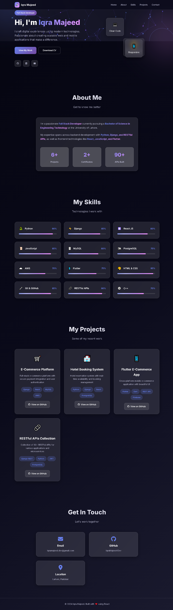

Client Portfolio Website
📋 Project Overview
This is a professional portfolio website developed for a client as a freelance project. The client provided design specifications and requested a modern, responsive portfolio built with React to showcase their skills, projects, and professional experience.

🚀 Built By
Sohaib Younas - Full Stack Web Developer & UI/UX Designer

## 👨‍💻 About Me:

I hold a Bachelor’s degree in Computer Science and currently work as a Police Station Assistant (PSA) in Punjab Police, where I handle data entry and administrative tasks. Alongside my job, I continue to grow my freelancing career with dedication and professionalism.

I am a WordPress developer with 3+ years of experience, specializing in WordPress, Elementor Pro, Wix, Shopify, HTML, CSS, and theme customization. I’ve successfully delivered projects for various clients, working with companies and freelancing on platforms like Upwork, Fiverr, and LinkedIn. My expertise ensures the creation of high-quality, responsive, and visually appealing websites tailored to meet client needs.

---

📋 About Project:

🎯 Client Demands

LinkedIn Connection: Client reached out via LinkedIn messaging

Primary Request: "Mujhe React mein portfolio banwa na hai"

Design Preference: Simple, clean and professional layout

Technology Specific: Must be built using React.js

Purpose: To showcase skills and projects to potential employers

💼 Client Communication

Platform: LinkedIn Messaging

Initial Contact: Client found my profile and directly messaged

Requirements Discussion: Detailed discussion about features and design

Timeline: Project completed within agreed deadline

🚀 Technical Delivery
Framework: React.js with modern hooks

Design: Simple, clean and professional UI

Responsive: Mobile-first approach

Deployment: GitHub Pages for easy access

Code Quality: Clean, maintainable React components

## 📸 Screenshots

Homepage Preview:

....

🔗 Project Links
Live Demo: https://sohaibyounas076.github.io/Client-Portfolio/

Source Code: https://github.com/Sohaibyounas076/Client-Portfolio

📞 Let's Work Together
I specialize in turning ideas into functional, beautiful web applications. Whether you need a portfolio website, e-commerce platform, or custom web application, I can bring your vision to life.
## 📩 Contact

Want to hire or collaborate with me? Feel free to reach out:

- 🌐 **Portfolio**: [https://sohaibyounas076.github.io/portfolio/](https://sohaibyounas076.github.io/portfolio/)  
- 📧 **Email**: sohaibyounas077@gmail.com  
- 🧑‍💼 **Lindin**: [https://Linkedin.com/sohaibyounas076](https://www.linkedin.com/in/sohaibyounas076/)
- 

This project was developed as a client order, demonstrating my ability to understand client requirements and deliver professional web solutions
